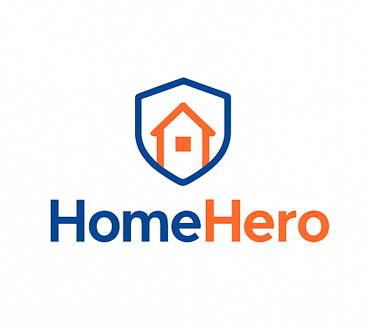

# HomeHero

Graduation project for DEPI: a home maintenance service platform.

<p align="center">
  
</p>


---

## 📚 Table of Contents
- [📌 Project Overview](#-project-overview)
- [🌐 Live Demo](#-live-demo)
- [🛠 Tech Stack](#-tech-stack)
- [📂 Project Structure](#-project-structure)
- [⚡ Getting Started](#-getting-started)
- [👥 Contributors](#-team-members)
- [📄 License](#-license)

---

## 📌 Project Overview
- 🔧 Built with ASP.NET Core + SQL Server
- 🎯 Purpose: Home Maintenance Service Platform
- 👥 Team: Home Hero

---
👥 Team Members

<a href="https://github.com/m-atef1999/HomeHero/graphs/contributors">  </a>

---

## 🌐 Live Demo
👉 [Check out the website](https://preview--homehero-design-kit.lovable.app/)

---

## 🛠 Tech Stack
- ASP.NET Core, C# (.NET 8)
- EF Core + SQL Server
- Blazor/MVC
- Docker
- GitHub Actions

---

## 📂 Project Structure
- **API endpoints** → `HomeHero.Api`
- **UI (MVC/Blazor)** → `HomeHero.Web`
- **Entities + services** → `HomeHero.Core`
- **EF Core DbContext + migrations** → `HomeHero.Infrastructure`
- **Tests** → `HomeHero.Tests`
- **Database scripts** → `db/`
- **Documentation** → `docs/`

---

## ⚡ Getting Started

```bash
git clone https://github.com/m-atef1999/HomeHero.git
cd HomeHero
dotnet run
```
---
## 📄 License

- This project is licensed under the MIT License.
