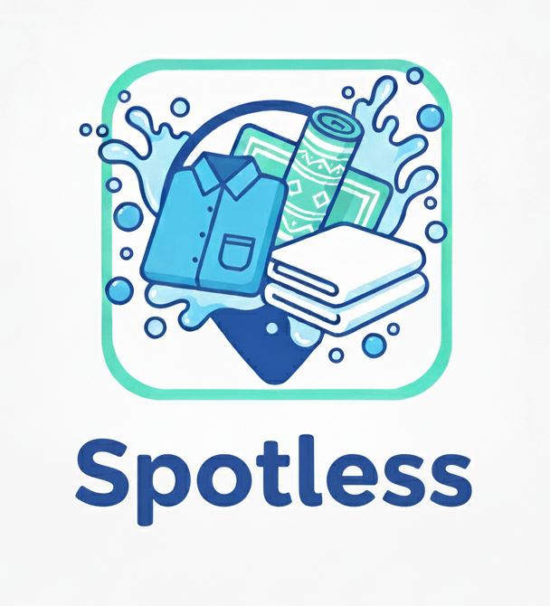

# Spotless

Graduation project for DEPI: a cleaning services platform.

<p align="center">
  
</p>


---

## 📚 Table of Contents
- [📌 Project Overview](#-project-overview)
- [🌐 Live Demo](#-live-demo)
- [🛠 Tech Stack](#-tech-stack)
- [📂 Project Structure](#-project-structure)
- [⚡ Getting Started](#-getting-started)
- [👥 Contributors](#-team-members)
- [📄 License](#-license)

---

## 📌 Project Overview
- 🔧 Built with ASP.NET Core + SQL Server
- 🎯 Purpose: Cleaning Services Platform
- 👥 Team: Cleaning Services Platform

---

## 👥 Team Members

| <a href="https://github.com/m-atef1999"><br /><span style="font-size:14px;"><b>Mahmoud Atef</b></span></a> | <a href="https://github.com/simonnoshy"><br /><span style="font-size:14px;"><b>Simon Noshy</b></span></a> | <a href="https://github.com/amiraamin279-collab"><br /><span style="font-size:14px;"><b>Amira Amin</b></span></a> | <a href="https://github.com/RodainaMahmoud"><br /><span style="font-size:14px;"><b>Rodaina Mahmoud</b></span></a> | <a href="https://github.com/Shosha101"><br /><span style="font-size:14px;"><b>Shosha</b></span></a> |
|---|---|---|---|---|


---

## 🌐 Live Demo
👉 [Check out the website](https://preview--quickclean-wash-wave.lovable.app/)

---

## 🛠 Tech Stack
- ASP.NET Core, C# (.NET 8)
- EF Core + SQL Server
- Blazor/MVC
- HTML, CSS, (Angular, React, Bootstrap)
- Docker
- Jira
- Figma
- GitHub Actions

---

## 📂 Project Structure
- **API endpoints** → `Spotless.Api`
- **UI (MVC/Blazor)** → `Spotless.Web`
- **Entities + services** → `Spotless.Core`
- **EF Core DbContext + migrations** → `Spotless.Infrastructure`
- **Tests** → `Spotless.Tests`
- **Database scripts** → `db/`
- **Documentation** → `docs/`

---

## ⚡ Getting Started

```bash
git clone https://github.com/m-atef1999/Spotless.git
cd Spotless
dotnet run
```
---
## 📄 License

- This project is licensed under the MIT License.
