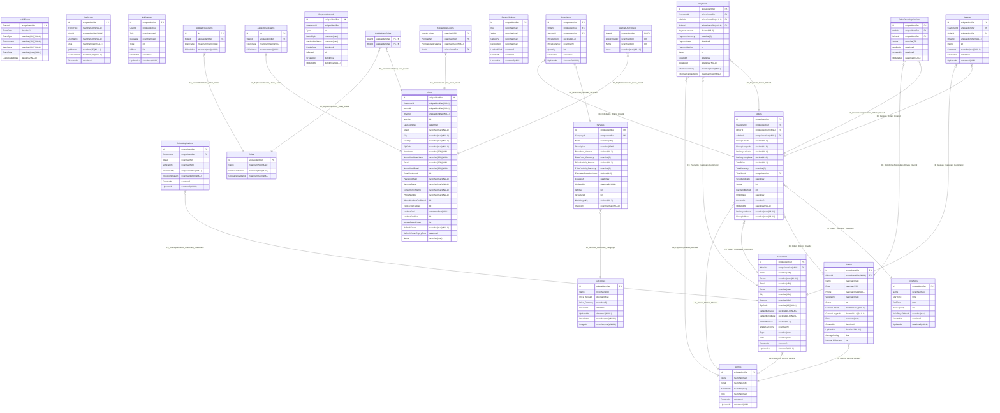

```mermaid
erDiagram
  Admins {
    Id uniqueidentifier PK
    Name nvarchar(max) 
    Email nvarchar(256) 
    AdminRole nvarchar(max) 
    Role nvarchar(max) 
    CreatedAt datetime2 
    UpdatedAt datetime2(NULL) 
  }
  AuditEvents {
    EventId uniqueidentifier PK
    EventDate datetime2 
    EventType nvarchar(200)(NULL) 
    Environment nvarchar(100)(NULL) 
    UserName nvarchar(200)(NULL) 
    EventData nvarchar(max)(NULL) 
    LastUpdatedDate datetime2(NULL) 
  }
  AuditLogs {
    Id uniqueidentifier PK
    EventType nvarchar(200)(NULL) 
    UserId uniqueidentifier(NULL) 
    UserName nvarchar(200)(NULL) 
    Data nvarchar(max)(NULL) 
    IpAddress nvarchar(45)(NULL) 
    CorrelationId nvarchar(100)(NULL) 
    OccurredAt datetime2 
  }
  Categories {
    Id uniqueidentifier PK
    Name nvarchar(100) 
    Price_Amount decimal(18-2) 
    Price_Currency nvarchar(3) 
    CreatedAt datetime2 
    UpdatedAt datetime2(NULL) 
    Description nvarchar(max)(NULL) 
    ImageUrl nvarchar(max)(NULL) 
  }
  Customers {
    Id uniqueidentifier PK
    AdminId uniqueidentifier(NULL) FK
    Name nvarchar(200) 
    Phone nvarchar(max)(NULL) 
    Email nvarchar(450) 
    Street nvarchar(max) 
    City nvarchar(100) 
    Country nvarchar(100) 
    ZipCode nvarchar(20)(NULL) 
    DefaultLatitude decimal(10-8)(NULL) 
    DefaultLongitude decimal(11-8)(NULL) 
    WalletBalance decimal(18-2) 
    WalletCurrency nvarchar(5) 
    Type nvarchar(max) 
    Role nvarchar(max) 
    CreatedAt datetime2 
    UpdatedAt datetime2(NULL) 
  }
  Customers }o--|| Admins : FK_Customers_Admins_AdminId
  DriverApplications {
    Id uniqueidentifier PK
    CustomerId uniqueidentifier FK
    Status nvarchar(50) 
    VehicleInfo nvarchar(500) 
    ReviewedBy uniqueidentifier(NULL) 
    RejectionReason nvarchar(1000)(NULL) 
    CreatedAt datetime2 
    UpdatedAt datetime2(NULL) 
  }
  DriverApplications }o--|| Customers : FK_DriverApplications_Customers_CustomerId
  Drivers {
    Id uniqueidentifier PK
    AdminId uniqueidentifier(NULL) FK
    Name nvarchar(max) 
    Email nvarchar(256) 
    Phone nvarchar(max)(NULL) 
    VehicleInfo nvarchar(max) 
    Status int 
    CurrentLatitude decimal(10-8)(NULL) 
    CurrentLongitude decimal(11-8)(NULL) 
    Role nvarchar(max) 
    CreatedAt datetime2 
    UpdatedAt datetime2(NULL) 
    AverageRating float 
    NumberOfReviews int 
  }
  Drivers }o--|| Admins : FK_Drivers_Admins_AdminId
  Notifications {
    Id uniqueidentifier PK
    UserId uniqueidentifier 
    Title nvarchar(max) 
    Message nvarchar(max) 
    Type int 
    IsRead bit 
    CreatedAt datetime2 
    UpdatedAt datetime2(NULL) 
  }
  OrderDriverApplications {
    Id uniqueidentifier PK
    OrderId uniqueidentifier FK
    DriverId uniqueidentifier FK
    Status nvarchar(50) 
    AppliedAt datetime2 
    CreatedAt datetime2 
    UpdatedAt datetime2(NULL) 
  }
  OrderDriverApplications }o--|| Drivers : FK_OrderDriverApplications_Drivers_DriverId
  OrderDriverApplications }o--|| Orders : FK_OrderDriverApplications_Orders_OrderId
  OrderItems {
    Id uniqueidentifier PK
    OrderId uniqueidentifier FK
    ServiceId uniqueidentifier FK
    PriceAmount decimal(18-2) 
    PriceCurrency nvarchar(5) 
    Quantity int 
    CreatedAt datetime2 
    UpdatedAt datetime2(NULL) 
  }
  OrderItems }o--|| Orders : FK_OrderItems_Orders_OrderId
  OrderItems }o--|| Services : FK_OrderItems_Services_ServiceId
  Orders {
    Id uniqueidentifier PK
    CustomerId uniqueidentifier FK
    DriverId uniqueidentifier(NULL) FK
    AdminId uniqueidentifier(NULL) FK
    PickupLatitude decimal(10-8) 
    PickupLongitude decimal(11-8) 
    DeliveryLatitude decimal(10-8) 
    DeliveryLongitude decimal(11-8) 
    TotalPrice decimal(18-2) 
    TotalCurrency nvarchar(5) 
    TimeSlotId uniqueidentifier FK
    ScheduledDate datetime2 
    Status int 
    PaymentMethod int 
    OrderDate datetime2 
    CreatedAt datetime2 
    UpdatedAt datetime2(NULL) 
    DeliveryAddress nvarchar(max)(NULL) 
    PickupAddress nvarchar(max)(NULL) 
  }
  Orders }o--|| Admins : FK_Orders_Admins_AdminId
  Orders }o--|| Customers : FK_Orders_Customers_CustomerId
  Orders }o--|| Drivers : FK_Orders_Drivers_DriverId
  Orders }o--|| TimeSlots : FK_Orders_TimeSlots_TimeSlotId
  PaymentMethods {
    Id uniqueidentifier PK
    CustomerId uniqueidentifier 
    Type int 
    Last4Digits nvarchar(max) 
    CardholderName nvarchar(max) 
    ExpiryDate datetime2 
    IsDefault bit 
    CreatedAt datetime2 
    UpdatedAt datetime2(NULL) 
  }
  Payments {
    Id uniqueidentifier PK
    CustomerId uniqueidentifier FK
    AdminId uniqueidentifier(NULL) FK
    OrderId uniqueidentifier(NULL) FK
    PaymentAmount decimal(18-2) 
    PaymentCurrency nvarchar(5) 
    PaymentDate datetime2 
    PaymentMethod int 
    Status int 
    CreatedAt datetime2 
    UpdatedAt datetime2(NULL) 
    ExternalGateway nvarchar(max)(NULL) 
    ExternalTransactionId nvarchar(max)(NULL) 
  }
  Payments }o--|| Admins : FK_Payments_Admins_AdminId
  Payments }o--|| Customers : FK_Payments_Customers_CustomerId
  Payments }o--|| Orders : FK_Payments_Orders_OrderId
  Reviews {
    Id uniqueidentifier PK
    CustomerId uniqueidentifier FK
    OrderId uniqueidentifier FK
    DriverId uniqueidentifier(NULL) 
    Rating int 
    Comment nvarchar(max)(NULL) 
    CreatedAt datetime2 
    UpdatedAt datetime2(NULL) 
  }
  Reviews }o--|| Customers : FK_Reviews_Customers_CustomerId
  Reviews }o--|| Orders : FK_Reviews_Orders_OrderId
  Services {
    Id uniqueidentifier PK
    CategoryId uniqueidentifier FK
    Name nvarchar(256) 
    Description nvarchar(1000) 
    BasePrice_Amount decimal(18-2) 
    BasePrice_Currency nvarchar(3) 
    PricePerUnit_Amount decimal(18-2) 
    PricePerUnit_Currency nvarchar(3) 
    EstimatedDurationHours decimal(4-2) 
    CreatedAt datetime2 
    UpdatedAt datetime2(NULL) 
    IsActive bit 
    IsFeatured bit 
    MaxWeightKg decimal(10-2) 
    ImageUrl nvarchar(max)(NULL) 
  }
  Services }o--|| Categories : FK_Services_Categories_CategoryId
  SystemSettings {
    Id uniqueidentifier PK
    Key nvarchar(max) 
    Value nvarchar(max) 
    Category nvarchar(max) 
    Description nvarchar(max) 
    LastModified datetime2 
    CreatedAt datetime2 
    UpdatedAt datetime2(NULL) 
  }
  TimeSlots {
    Id uniqueidentifier PK
    Name nvarchar(max) 
    StartTime time 
    EndTime time 
    MaxCapacity int 
    ValidDaysOfWeek nvarchar(max) 
    CreatedAt datetime2 
    UpdatedAt datetime2(NULL) 
  }
  AspNetRoleClaims {
    Id int PK
    RoleId uniqueidentifier FK
    ClaimType nvarchar(max)(NULL) 
    ClaimValue nvarchar(max)(NULL) 
  }
  AspNetRoleClaims }o--|| Roles : FK_AspNetRoleClaims_Roles_RoleId
  AspNetUserClaims {
    Id int PK
    UserId uniqueidentifier FK
    ClaimType nvarchar(max)(NULL) 
    ClaimValue nvarchar(max)(NULL) 
  }
  AspNetUserClaims }o--|| Users : FK_AspNetUserClaims_Users_UserId
  AspNetUserLogins {
    LoginProvider nvarchar(450) PK
    ProviderKey nvarchar(450) PK
    ProviderDisplayName nvarchar(max)(NULL) 
    UserId uniqueidentifier FK
  }
  AspNetUserLogins }o--|| Users : FK_AspNetUserLogins_Users_UserId
  AspNetUserRoles {
    UserId uniqueidentifier PK,FK
    RoleId uniqueidentifier PK,FK
  }
  AspNetUserRoles }o--|| Roles : FK_AspNetUserRoles_Roles_RoleId
  AspNetUserRoles }o--|| Users : FK_AspNetUserRoles_Users_UserId
  AspNetUserTokens {
    UserId uniqueidentifier PK,FK
    LoginProvider nvarchar(450) PK
    Name nvarchar(450) PK
    Value nvarchar(max)(NULL) 
  }
  AspNetUserTokens }o--|| Users : FK_AspNetUserTokens_Users_UserId
  Roles {
    Id uniqueidentifier PK
    Name nvarchar(256)(NULL) 
    NormalizedName nvarchar(256)(NULL) 
    ConcurrencyStamp nvarchar(max)(NULL) 
  }
  Users {
    Id uniqueidentifier PK
    CustomerId uniqueidentifier(NULL) 
    AdminId uniqueidentifier(NULL) 
    DriverId uniqueidentifier(NULL) 
    IsActive bit 
    LastLoginDate datetime2 
    Street nvarchar(max)(NULL) 
    City nvarchar(max)(NULL) 
    Country nvarchar(max)(NULL) 
    ZipCode nvarchar(max)(NULL) 
    UserName nvarchar(256)(NULL) 
    NormalizedUserName nvarchar(256)(NULL) 
    Email nvarchar(256)(NULL) 
    NormalizedEmail nvarchar(256)(NULL) 
    EmailConfirmed bit 
    PasswordHash nvarchar(max)(NULL) 
    SecurityStamp nvarchar(max)(NULL) 
    ConcurrencyStamp nvarchar(max)(NULL) 
    PhoneNumber nvarchar(max)(NULL) 
    PhoneNumberConfirmed bit 
    TwoFactorEnabled bit 
    LockoutEnd datetimeoffset(NULL) 
    LockoutEnabled bit 
    AccessFailedCount int 
    RefreshToken nvarchar(max)(NULL) 
    RefreshTokenExpiryTime datetime2 
    Name nvarchar(max) 
  }
```
