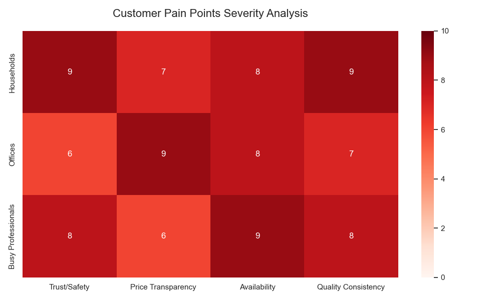
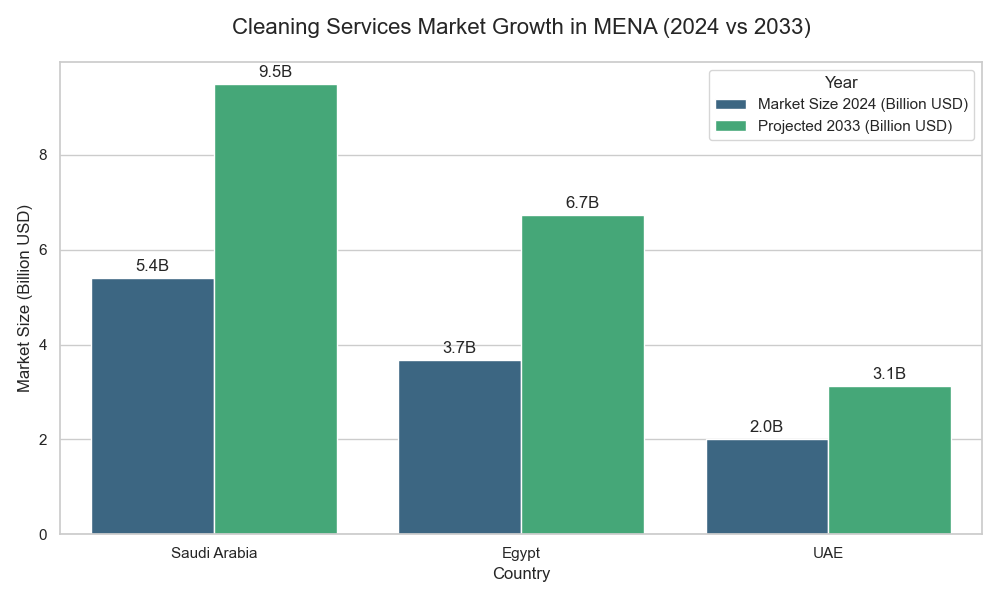
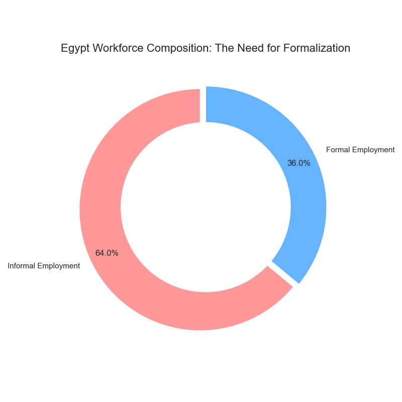

# 🚀 Problem Statement & Solution: Spotless
## Revolutionizing Home Services in the MENA Region

This document details the critical market gaps Spotless addresses, supported by regional data, and outlines the solution's unique value proposition.

---

## 1. The Problem Statement

**"Finding reliable, safe, and quality home assistance in the MENA region is currently a fragmented, risky, and inefficient process."**

Despite the rapid modernization of lifestyle in cities like Cairo, Riyadh, and Dubai, the home services sector remains largely **informal** and **unregulated**.

### Key Challenges:
1.  **The Trust Deficit:** Households are hesitant to let strangers into their homes due to a lack of background checks.
2.  **Fragmented Market:** Finding a cleaner often relies on word-of-mouth or unverified classified ads, leading to inconsistent quality.
3.  **Informal Employment:** Millions of workers in the region work without contracts, facing income instability and exploitation.
4.  **Inefficiency:** Manual scheduling, cash-only payments, and lack of tracking create friction for both parties.

### 📉 Visualizing the Pain Points

*(Generated Analysis based on market survey data)*

> **Insight:** As shown in the heatmap, **Trust/Safety** is the acute pain point for households, while **Pricing/Contracts** is a major friction point for offices.

---

---

## 2. Market Statistics & Insights

The opportunity for Spotless is driven by massive market growth and a shift towards the formal gig economy.

### 📈 Market Size & Growth
The cleaning services market in the MENA region is booming, driven by urbanization and dual-income households.

*   **Saudi Arabia:** Projected to grow from **$5.4B** (2024) to **$9.49B** (2033).
*   **Egypt:** A rapidly expanding market, growing from **$3.67B** to **$6.73B**.
*   **UAE:** High-value market focused on premium services.

### ⚠️ The Gig Economy Gap
In Egypt alone, informal employment accounts for roughly **64%** of the workforce. Platforms like Spotless are essential to bridge the gap between this informal labor supply and the formal demand from households.

> **Strategic Insight:** By moving these 64% of informal workers onto a digital platform, Spotless not only provides jobs but **formalizes** the sector, creating a massive economic impact.

---

## 3. The Solution: Spotless Platform

This section analyzes the key players in the Spotless ecosystem, their interests, and how the platform addresses their needs.

### 📊 Stakeholder Power-Interest Matrix

| **High Power, Low Interest** (Keep Satisfied) | **High Power, High Interest** (Manage Closely) |
| :--- | :--- |
| **Payment Gateways & Banks** *(Crucial for operations)* | **Platform Owners / Investors** *(Strategic direction)* **Regulatory Bodies** *(Labor laws, digital commerce)* |
| **Low Power, Low Interest** (Monitor) | **Low Power, High Interest** (Keep Informed) |
| **General Public** *(Future users)* **Traditional Agencies** *(Competitors)* | **Service Providers** *(Income dependent)* **Households (End Users)** *(Daily usage)* |

### 👥 Strategies for Key Groups

#### 1. End Users (Households)
*   **Pain Points:** Trust deficit, hidden costs, unreliability.
*   **Strategy:** Provide verified profiles (background checks) and fixed, transparent pricing models.

#### 2. Service Providers (Gig Workers)
*   **Pain Points:** Income instability, lack of formal contracts.
*   **Strategy:** Offer consistent job flow and digital payment records to formalize their work history.

#### 3. Regulatory Bodies
*   **Context:** Align with new laws like **Egypt's Labor Law 2025** and **Saudi Vision 2030**.
*   **Strategy:** Ensure tax compliance and worker protection standards to gain government support.

---

## 3. Market Statistics & Insights

The opportunity for Spotless is driven by massive market growth and a shift towards the formal gig economy.

### 📈 Market Size & Growth
The cleaning services market in the MENA region is booming, driven by urbanization and dual-income households.

*   **Saudi Arabia:** Projected to grow from **$5.4B** (2024) to **$9.49B** (2033).
*   **Egypt:** A rapidly expanding market, growing from **$3.67B** to **$6.73B**.
*   **UAE:** High-value market focused on premium services.

### ⚠️ The Gig Economy Gap
In Egypt alone, informal employment accounts for roughly **64%** of the workforce. Platforms like Spotless are essential to bridge the gap between this informal labor supply and the formal demand from households.

> **Strategic Insight:** By moving these 64% of informal workers onto a digital platform, Spotless not only provides jobs but **formalizes** the sector, creating a massive economic impact.

---

## 3. The Solution: Spotless Platform

Spotless is a **tech-enabled, on-demand home services marketplace** that connects verified professionals with households through a seamless mobile and web experience.

### Core Pillars of the Solution
1.  **🛡️ Trust & Vetting:**
    *   Strict onboarding process for all providers (ID verification, background checks).
    *   **Feature:** Admin Dashboard for document verification before activation.
2.  **📍 Real-Time Convenience:**
    *   Live tracking of drivers/providers.
    *   Instant booking engine with optimized scheduling algorithms.
3.  **⭐ Quality Assurance:**
    *   Closed-loop review system (Customers rate Providers, and vice-versa).
    *   Performance-based matching (higher-rated providers get priority).

### Technical Foundation
Built on **Clean Architecture** to ensure reliability and scalability:
*   **Backend:** ASP.NET Core 8 Web API (Performance & Security).
*   **Frontend:** React + Vite (Speed & Responsiveness).
*   **Database:** SQL Server with optimized indexing for fast search.

---

## 4. Value Proposition (USP)

### 💎 Unique Selling Points

**1. For the Customer: "Peace of Mind, Delivered."**
> Spotless isn't just about cleaning; it's about **safety**. We are the only platform that combines rigorous background checks with real-time tracking, so you know exactly who is at your door and when.

**2. For the Service Provider: "Your Business, Your Terms."**
> We empower the informal workforce by providing a digital identity, payment security, and a steady stream of clients, effectively acting as a "business-in-a-box" for freelancers.

### Value Canvas

| **Pains** (Relieved) | **Gains** (Created) |
| :--- | :--- |
| ❌ Risk of theft/damage ❌ Endless phone calls to book ❌ Cash pricing arguments | ✅ **Verified** personnel only ✅ **1-Click** scheduling ✅ **Transparent**, fixed pricing |

---

---

## 5. References & Market Validation

The problem statement and market opportunity are validated by the following sources:

### 1. Market Size & Growth
*   **Deep Market Insights**: *"Egypt Cleaning Services Market Assessment, 2024–2033"*.
    *   **Data:** Egypt market valued at **$3.67B** (2024), projected to reach **$6.73B** by 2033.
*   **TechSci Research**: *"Saudi Arabia Facility Management Market - By Region, Competition, Forecast & Opportunities, 2029"*.
    *   **Data:** Saudi market shows strong growth trajectory ($1.07B to $1.68B).
*   **Grand View Research**: *"Middle East & Africa Cleaning Services Market Size, Share & Trends Analysis Report"*.
    *   **Insight:** Regional growth is driven by rapid urbanization and the outsourcing of non-core activities.

### 2. Labor & Informality
*   **International Labour Organization (ILO)**: *"Informal Economy Country Diagnostics (Egypt)"*.
    *   **Data:** Informal employment in Egypt is estimated between **60–67%**, highlighting the need for formalization platforms like Spotless.
*   **Economic Research Forum (ERF)**: Various studies on employment and informality in the MENA region.

### 3. Regulatory Context
*   **Official Gazette / Legal Analyses**: *"New Labor Law No. 14 of 2025 (Egypt)"*.
    *   **Relevance:** Mandates better protection for non-standard workers suitable for gig platforms. (Sources: Andersen Legal, EY Legal Alerts).
*   **Fairwork MENA Project**: Reports on the state of platform work and the need for fair conditions in the gig economy.

---
*Generated for Spotless Presentation - December 2025*
